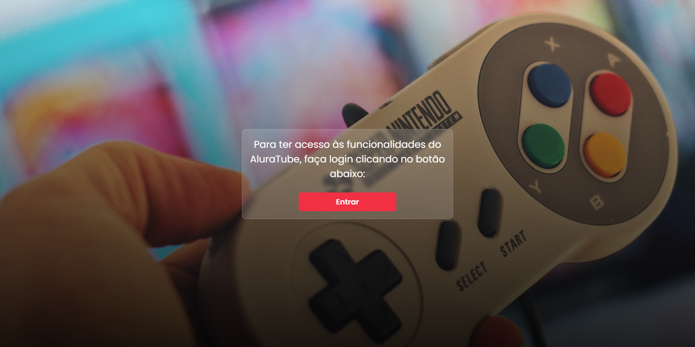
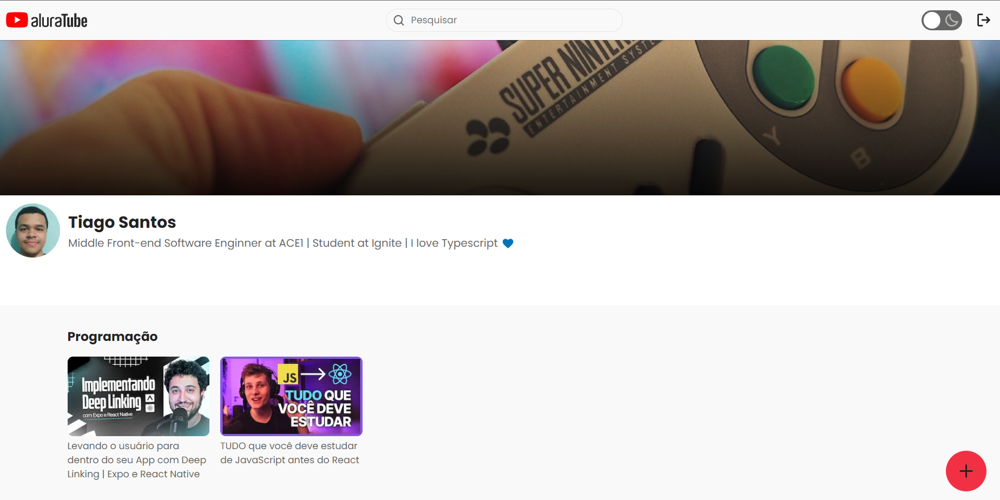

<h1 align="center">AluraTube</h1>

<p align="center">
  
  
  <a href="https://github.com/jtiagosantos/alura-tube/commits/master">
    
  </a>
  
   <a href="https://github.com/jtiagosantos/alura-tube/stargazers">
    
  </a>
</p>

<h4 align="center"> 
  🚧 AluraTube 🎬 Completed 🚀 🚧
</h4>

<p align="center">
  <a href="#-features">Features</a> •
  <a href="#-run-project">Run Project</a> • 
  <a href="#-technologies">Technologies</a> • 
  <a href="#-author">Author</a> • 
  <a href="#-license">License</a>
</p>

<br>

<h1 align="center">
  
</h1>

<h1 align="center">
  
</h1>

<h1 align="center">
  
</h1>


## ⚙️ Features

- [x] Authentication with Github
- [x] View your youtube videos
- [x] View your favorite aluratubes
- [x] Add new playlist functionality  
- [x] Add new video funcionality
- [x] Video preview at time of add it   
- [x] Search video functionality
- [x] Light/Dark mode

<br>

## 🚀 Run Project

1️⃣ Clone project and access its folder:

```bash
$ git clone https://github.com/jtiagosantos/alura-tube.git
$ cd alura-tube
```

2️⃣ Install dependencies:

```bash
$ yarn
```

3️⃣ Define environment variables:

```bash
#NEXTAUTH
NEXTAUTH_SECRET_KEY=""

#SUPABASE
NEXT_PUBLIC_SUPABASE_PROJECT_URL=""
NEXT_PUBLIC_SUPABASE_API_KEY=""

#GITHUB
NEXT_PUBLIC_GITHUB_CLIENT_ID=""
NEXT_PUBLIC_GITHUB_CLIENT_SECRET_KEY=""
```

4️⃣ Start project:

```bash
$ yarn dev
```

<br>


## 🛠 Technologies

The following tools were used in the construction of project:

- **[Next.js](https://nextjs.org/docs/getting-started)**
- **[Typescript](https://www.typescriptlang.org/)**
- **[Supabase](https://supabase.com/docs/reference)**
- **[NextAuth](https://next-auth.js.org/getting-started/introduction)**
- **[Stitches](https://stitches.dev/)**
- **[RadixUI](https://www.radix-ui.com/)**
- **[Next-Themes](https://www.npmjs.com/package/next-themes)**
- **[Axios](https://axios-http.com/docs/intro)**

<br>

## 👨‍💻 Author


<strong><a href="https://github.com/jtiagosantos">Tiago Santos </a>🚀</strong>

[](https://www.linkedin.com/in/josetiagosantosdelima/)
[](mailto:tiago.santos@icomp.ufam.edu.br)

<br>

## 📝 License

This project is under license [MIT](./LICENSE).
